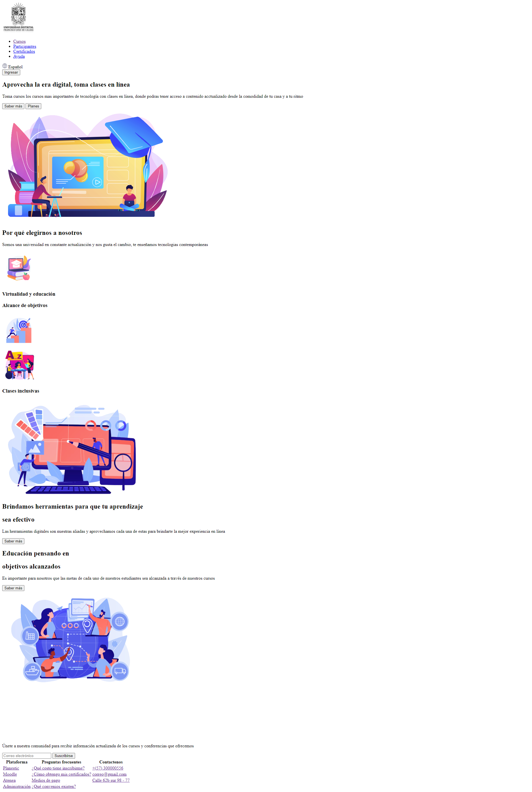

<h1>Taller 9 NICOLAS RODRIGUEZ CASTILLO</h1>
<h2>Informacion</h2>

<b>Curso:</b> Full Stack Basico - Grupo 1

<b>Profesor:</b> CRISTIAN PATIÑO

<h2>Link de la pagina web</h2>

<h2>Punto 1: Link de Figma</h2>
<a href= "https://www.figma.com/file/r8MGj6kKXTO5zKkJoHxpBp/Nicolas-Rodriguez-Castillo?type=design&node-id=0%3A1&mode=design&t=G7vCNuS2tJhcLo4y-1" target="_blank"> Link de Figma</a>

<h2>Punto 2: Diseño  en HTML</h2>

<h2>Punto 3: Diseño con CSS</h2>

<h2>Punto 4: Títulos</h2>

<h2>Punto 5: Párrafo</h2>

<h2>Punto 6: Links</h2>

<h2>Punto 7 y 8: Navegacion</h2>

<h2>Punto 9: Tabla</h>